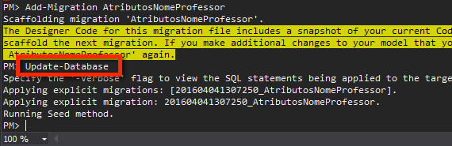

# Migrations #

## usando o NugetPackageManager

1 - Abrir o package Manager

2 - Executar Enable-Migrations + nome do contexto. Caso não seja informado o nome do contexto a ser utilizado.
Dica- Executar apenas o Enable-Migrations, que será exibida uma mensagem de erro e irá sugerir o nome do contexto.

Apos execução, é criada uma pasta com todas as Migrations.

3 - Faz alteração na classe

4 - Adicionar nova Migrations: `Add-Migration NomeQueEuquerodar`

5 - Update-Database

5 - caso altere algo nas classes em nível de estrutura
das tabelas no banco, use:
Add-Migration label (AtribuiCamposObrigatorios)

6 - `Update-Database` usando a opcao `-verbose` é exibido o script que foi executado no migrations.

7 - `Update-Database` usando a opcao `-script` é exibido o script em uma nova janela, mas não é executado no banco.

### outras dicas ###

* o Comando `Update-Database -target nomeConfiguracao(label)` volta o banco ao label informado.

* `Update-Database -target <nome da migracao> -force` força a instalação de um pacote específico.

Outros Comandos do Nuget

    Update-Package pacote
    Install-Package pacote -version x
    Uninstall-Package pacote

Para novas entidades

    //criar a classe ex:provas  e referencia-la no DbContext
    DbSet<classe>
    Add-Migration addProvas
    Update-Database
