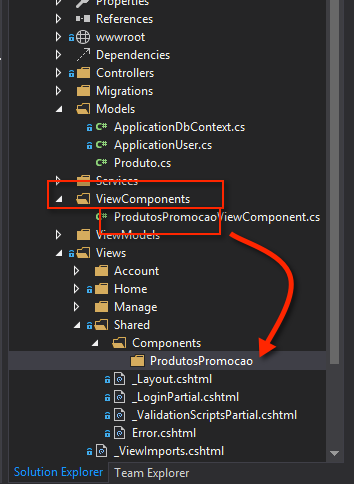
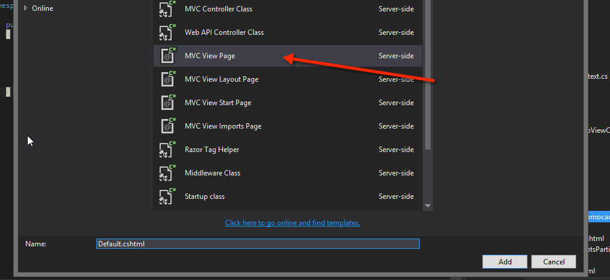
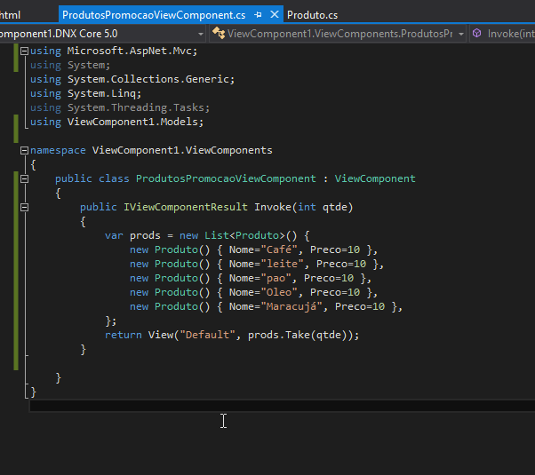
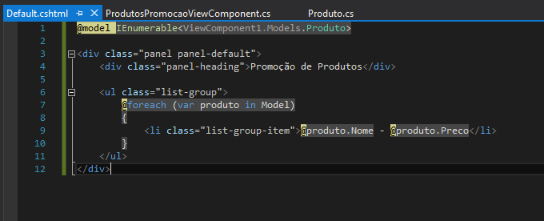
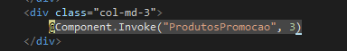
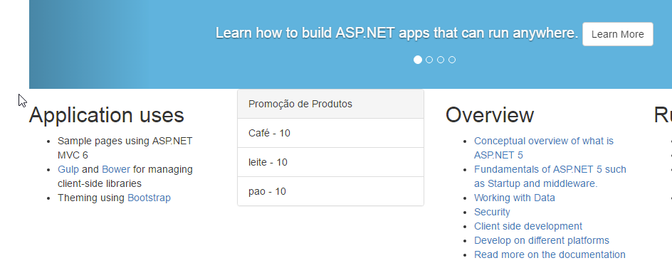

# Usando view Components

### Vantagem de uso e funcionamento ###
A grande vantagem de uso dos ViewComponents é que eles estão associados a um "Controller" particular, diferente das partial views das versões anteriores que compartilhavam o mesmo controller da view principal - passando apenas algum objeto como parametro. Isso permite uma compartimentalização melhor das responsabilidades de cada trecho do código.

### Criar a pasta de view componets ###

a pasta tem que ter o nome viewComponents, e o viewComponent tem que terminar com o nome ViewComponent, por padrão de desenvolvimento.
Ele também herda de `ViewComponent`

É preciso também criar, dentro da pasta `Shared` as pastas `Components` e depois a pasta com o mesmo nome das suas ViewsComponents, no caso `ProdutosPromocao`

 

Action invoke da classe ViewComponent

 

Codigo que está dentro da view Default.cshtml

Chamada do ViewComponent dentro do meu index.cshtml

Resultado:

